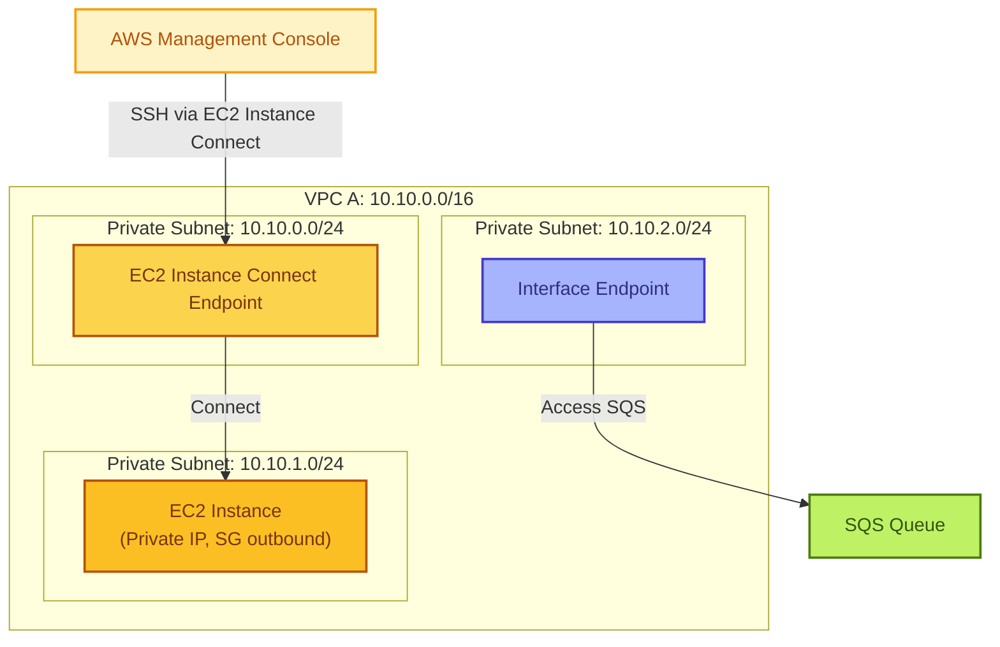

# 62. VPC Interface Endpoint

## 構成図




## 準備

### Installation

* aws cli
* terraform

### tfstate 用の S3 を作成

```bash
YOUR_NAME="toge510" <- ここを更新

CURRENT_TIME=$(date +"%Y%m%d%H%M%S")
BUCKET_NAME="tfstate-${YOUR_NAME}-${CURRENT_TIME}"
echo "$BUCKET_NAME"

aws s3api create-bucket \
  --bucket "$BUCKET_NAME" \
  --region ap-northeast-1 \
  --create-bucket-configuration LocationConstraint=ap-northeast-1
```

### main.tf を変更

`./terraform/main.tf`の 3 行目を変更

```bash
terraform {
  backend "s3" {
    bucket  = "tfstate-toge510-20250721182240" <- ここを更新
    key     = "terraform.tfstate"
    region  = "ap-northeast-1"
    encrypt = true
  }
}
```

### git clone 

```bash
git clone https://github.com/toge510/aws_ans_practice.git
cd aws_ens_practice
```

### terraform 適用

```bash
cd ./terraform
terraform apply
-> yes
```

## EC2からSQSにメッセージを送る

EC2に、EC2 Instance Connect Endpointを使って、ssh接続する。


VPC Endpoint for sqsにおいて、`private_dns_enabled = true` のため、nslookup でEndpointのDNS名を名前解決すると、pravate IPアドレスに解決されることを確認。

```bash
nslookup sqs.ap-northeast-1.amazonaws.com
```

sqsにメッセージを送信

```
aws sqs send-message --queue-url https://sqs.ap-northeast-1.amazonaws.com/624838222411/my-queue --message-body "This is test message 1" --region ap-northeast-1 --endpoint-url https://vpce-0a6784e1fe5fe105c-c5voyzfg.sqs.ap-northeast-1.vpce.amazonaws.com
```

sqsにおいて、メッセージを送受信でメッセージをポーリングして、メッセージを確認。