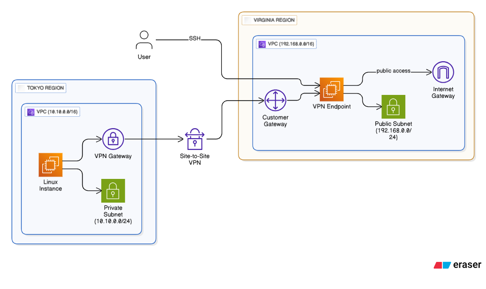

# 96. Site to Site VPN

## 構成図



## 準備

### Installation

* aws cli
* terraform

### tfstate 用の S3 を作成

```bash
YOUR_NAME="toge510" <- ここを更新

CURRENT_TIME=$(date +"%Y%m%d%H%M%S")
BUCKET_NAME="tfstate-${YOUR_NAME}-${CURRENT_TIME}"
echo "$BUCKET_NAME"

aws s3api create-bucket \
  --bucket "$BUCKET_NAME" \
  --region ap-northeast-1 \
  --create-bucket-configuration LocationConstraint=ap-northeast-1
```

### main.tf を変更

`./terraform/main.tf`の 3 行目を変更

```bash
terraform {
  backend "s3" {
    bucket  = "tfstate-toge510-20250721182240" <- ここを更新
    key     = "terraform.tfstate"
    region  = "ap-northeast-1"
    encrypt = true
  }
}
```

### git clone 

```bash
git clone https://github.com/toge510/aws_ans_practice.git
cd aws_ens_practice
```

### terraform 適用

```bash
cd ./terraform
terraform apply
-> yes
```

## EC2からサンプルファイルをs3:にアップロード

EC2：ec2demoに、EC2 Instance Connect Endpointを使って、ssh接続する。

```bash
INSTANCE_ID=$(aws ec2 describe-instances \
  --filters "Name=tag:Name,Values=ec2demo" "Name=instance-state-name,Values=running" \
  --query "Reservations[0].Instances[0].InstanceId" \
  --output text)
echo $INSTANCE_ID
aws ec2-instance-connect ssh --instance-id "$INSTANCE_ID"
```

`sample.txt`を作成して、`s3://aws-vpc-endpoint-demo-202507212200`にアップロードする。

```bash
echo "This is a sample file" >  sample.txt
cat sample.txt
aws s3 cp ./sample.txt s3://aws-vpc-endpoint-demo-202507212200
```

## Libreswan設定手順（EC2-VPN in virginia region / us-east-1）

参考：https://blog.usize-tech.com/aws-site-to-site-vpn-poc/

1. Libreswanインストール

```bash
sudo yum install libreswan -y
```

2. 設定ファイル編集

`/etc/ipsec.conf` にVPN接続情報を記述します。

```
conn Tunnel1
	authby=secret
	auto=start
	left=%defaultroute
	leftid=100.27.27.223
	right=13.230.196.166
	type=tunnel
	ikelifetime=8h
	keylife=1h
	phase2alg=aes128-sha1;modp2048
	ike=aes128-sha1;modp2048
	keyingtries=%forever
	keyexchange=ike
	leftsubnet=192.168.0.0/24
	rightsubnet=10.10.0.0/24
	dpddelay=10
	retransmit-timeout=30s
	dpdaction=restart_by_peer

```

3. 事前共有鍵の設定

`/etc/ipsec.secrets` にPSK（事前共有鍵）を記述。

例:

```
<自分のグローバルIP> <AWS側のVPNゲートウェイIP> : PSK "xxxxxxxxxxxxxxxx"
```

4. サービス起動・有効化

```bash
sudo systemctl start ipsec
sudo systemctl enable ipsec
```

5. 接続確認

```bash
sudo ipsec status
```